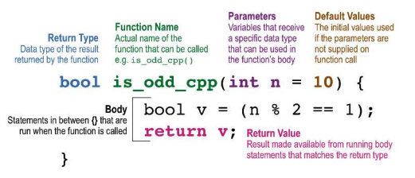
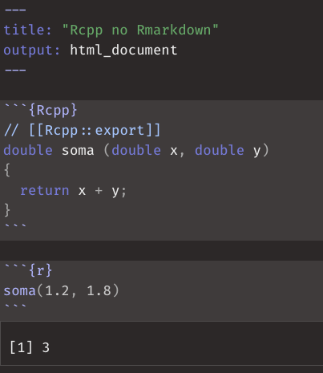

class: middle, center, inverse

# Acelerando o R com C++


```{r setup, include=FALSE}
knitr::opts_chunk$set(eval = TRUE, echo = FALSE, 
                      dpi = 96, fig.height = 4.7, 
                      fig.width = 10, fig.retina = 3)
library(tidyverse)
```

---

## Nesse curso vamos falar de

.pull-left[

### Introdução

- Diferenças entre R e C++
- O que é {Rcpp}?
- Quando usar {Rcpp}?
- Introdução ao {Rcpp}

### Intermediário

- Usando matrizes e arrays
- Como interromper loops pelo R
- Casos de uso
- Ponteiros externos (XPtrs)

]

.pull-right[

### Miscelânea

- Pacotes com código C++
- Um pouco sobre a API do R em C
- Introdução ao `{cpp11}` 

]

---

## Diferenças entre R e C++

- As duas linguagens tem propósitos bastante diferentes. O R é uma linguagem focada em análise de dados e tem bastante desenvolvimento pensado na interatividade. 

- C++ é uma linguagem de mais baixo nível e tem foco em performance e proximidade com a linguagem de máquina. É uma linguagem de propósito muito mais geral.

- Apesar de as duas linguagens possuirem muitos paradigmas diferentes. R tende a ser uma linguagem funcional: em geral escrevemos o que queremos fazer e não o 'como fazer'. C++ é imperativa, o que implica em escrever exatamente o 'como fazer'.

Dito isso, as principais diferenças que precisam ser compreendidas por um programador R aprendendo C++ são:


---

## Diferenças entre R e C++

.pull-left[

### R

- **interpretada**: existe um interpretador que *parseia* o código e o executa. Esse processo ocorre toda vez que uma linha de código é executada.

- **tipada dinamicamente**: os tipos dos objetos só são verificados na hora da execução do código.

]

.pull-right[

### C++

- **(pré) compilada**: o código é compilado, isto é, transformado em linguagem de máquina e depois pode ser executado. Não é necessário nenhum interpretador para executar o código.

- **estaticamente tipada**: durante o processo de compilação verifica-se se os tipos estão corretos. Por exemplo: uma função que retorna um número inteiro só pode retornar um número inteiro.


]

---

## Diferenças entre R e C++

Além de todas as diferenças conceituais, é claro, as duas linguagens também diferem bastante com relação à sintaxe.

.pull-left[

```{r, echo = TRUE}
hello <- function(name) {
  print(paste("hello", name))
}
hello("world")
```

]

.pull-right[

```{Rcpp, echo = TRUE}
#include <Rcpp.h>
// [[Rcpp::export]]
void hello (std::string name)
{
  Rcpp::Rcout << 
    "hello " + name << 
      std::endl;
}
```

```{r, echo = TRUE}
hello("world")
```

]

---

## Rcpp

- O R é escrito principalmente em C (não é C++) e então o R possui uma API em C
que permite que você crie extensões.

- A API do R é difícil e exige que você conheça bastante detalhes da linguagem.
Além disso, você precisa entender bastante como funciona o *garbage collector*
para poder usar corretamente a API em C.

- Rcpp não apenas implementa uma forma de chamar funções do C++ a partir da API
do R que é escrita em C, como fornece um conjunto grande de *açúcar sintático* 
para você não precisar entender tantos detalhes da API C do R.

- O pacote Rcpp é um dos mais utilizados no CRAN e é atualmente a principal
ferramenta para criar extensões do R que utilizam C/C++

---

## Quando usar Rcpp?

Existem dois principais motivos para usar Rcpp:

1. Você um código lento em R (geralmente envolvendo loops) que não é trivial de
vetorizar. Seu objetivo então, é escrever esse código em C++ para se beneficiar 
da velocidade, sem necessariamente precisar mudar o algoritmo.

Essa é talvez a forma mais comum de se usar Rcpp. Você escreve seu código em R,
e otimiza as partes que são *funis* de performance em C++. Pacotes como {text2vec},
{ranger}, {tm} e versões anteriores do {dplyr} usam Rcpp desta forma.

2. Você deseja usar, pelo R, uma biblioteca já consolidada escrita em C++. 
Por exemplo, a [libmagick]() é uma biblioteca escrita em C++ que possui diversas
funções para manipulação de imagens - ao invés de re-escrever a sua funcionalidade
em R, usamos Rcpp para *conectá-la* ao R.

Pacotes como {magick}, {hunspell}, {haven}, {opencv} e etc. usam Rcpp desta forma. 

---

## Ambiente de desenvolvimento

.pull-left[

### Linux 

- Instalar o `r-base-dev`: rodar `sudo apt-get install r-base-dev`.

### Mac

- Instalar o Xcode Command Line Tools. Rodar: `xcode-select --install` no terminal.

]

.pull-right[

### Windows

- Instalar o [RTools](https://cran.r-project.org/bin/windows/Rtools/history.html): o RTools junta um compilador (MinGW) de código C++, um compilador de Latex e outras ferramentas úteis.

]

---

## Introdução ao Rcpp

O esquema abaixo apresenta o esqueleto de uma função C++:

.center[


Fonte: [*Extending R with C++: A Brief Introduction to Rcpp*](https://cran.r-project.org/web/packages/Rcpp/vignettes/Rcpp-introduction.pdf)
]

---

## RMarkdown & Rcpp

O RMarkdown é uma ferramenta legal para começar a aprender Rcpp, pela facilidade de programar nas duas linguagens.

.pull-left[

- na primeira parte do curso vamos usar o RMarkdown e quando usarmos
  pacotes vamos programar em arquivos separados.
  
- é possível usar a função `Rcpp::cppFunction()` para escrever os
  códigos em scripts `.R`.

]

.pull-right[



]

---
class: middle, center

### Exemplo 1

---

class: middle, center

### Exercício 1

